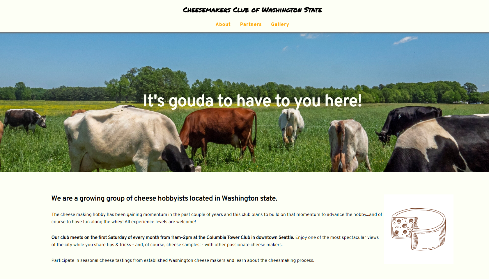

# Club Website

A Codecademy project in the Front-End-Engineer career path. 

## Description 
A club group page that will dynamically respond as you adjust the size of your screen.  

## Snapshot

## Link 

https://chloeharris1.github.io/club-website/

## Credits

Cheese Favicon from [Luvdat](https://www.flaticon.com/authors/luvdat)

Cheese Sketch:
[gstudioimagen](https://www.vecteezy.com/members/gstudioimagen)

Images from: 

[rawpixel](https://www.rawpixel.com)

[Washington State Cheesmakers Association](https://www.facebook.com/WashingtonStateCheese/photos)

[New England Cheese Making Supply Co](https://cheesemaking.com/)

## Questions 
[Email Me](Chloe.a.harris17@gmail.com) if you have any questions.

Check out more of my work on [GitHub](https://github.com/chloeharris1).